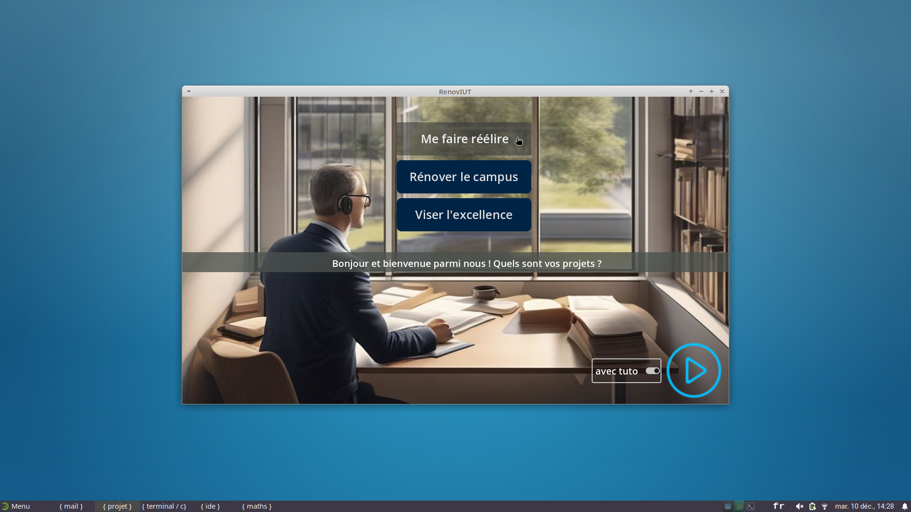
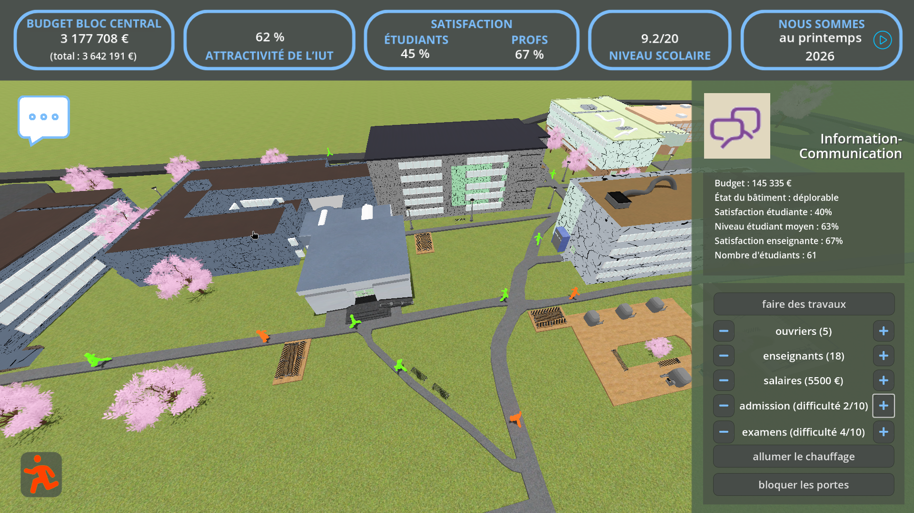
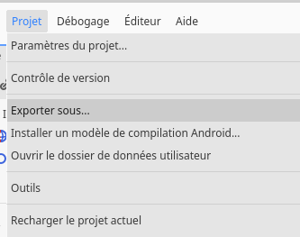
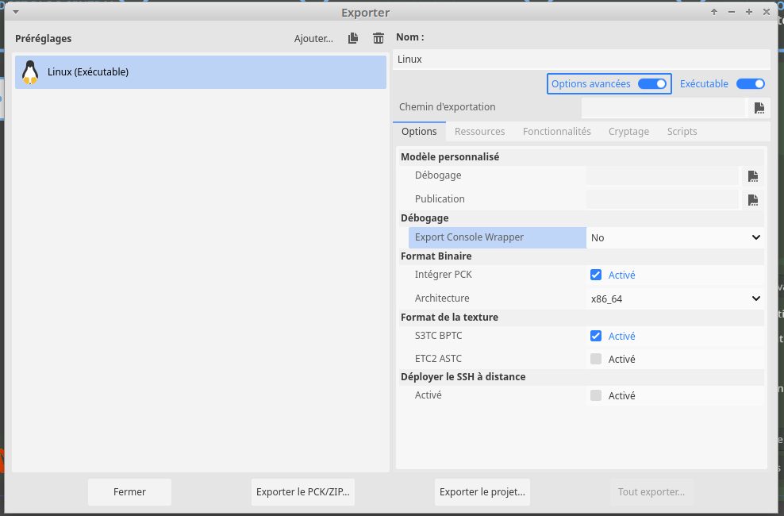

# T3 - RenovIUT

- Nom du groupe : Coruscant
- Membres du groupe : [Yasmine CHETTATI](https://git.unistra.fr/ychettati), [Elena FRISON](https://git.unistra.fr/e.frison), [Martin FRISON](https://git.unistra.fr/martin.frison).

	[Adrien AKGUL](https://git.unistra.fr/aakgul) a également contribué au projet à ses débuts.

## Présentation du projet

Vous incarnez le directeur de l'IUT Robert Schuman qui intervient sur le campus d'Illkirch pour assurer l'entretien et les rénovations des bâtiments et des infrastructures, tout en faisant face aux aléas du quotidien.

### Captures d'écran

Toutes les images utilisées sont libres de droits :

- [Banque de photos de l'IUT Robert Schuman](https://seafile.unistra.fr/d/03767a1835b7493b83a6/?p=%2FBelles%20photos%20(libre%20de%20droits)&mode=list);
- Dessinées par nous-mêmes, à base d'images libres trouvées sur Internet.

<p style="text-align: center;"></p>

<p style="text-align: center;"><small>Fig.1. Début du jeu</small></p>

<p style="text-align: center;"></p>

<p style="text-align: center;"><small>Fig.2. Fenêtre principale : le campus au printemps</small></p>

<p style="text-align: center;"></p>

<p style="text-align: center;"><small>Fig.3. Vue de devant</small></p>

<p style="text-align: center;"></p>

<p style="text-align: center;"><small>Fig.4. Notification volante</small></p>

<p style="text-align: center;"></p>

<p style="text-align: center;"><small>Fig.5. L'historique</small></p>

### Installation et exécution

Plusieurs options sont possibles.

Vous pouvez toujours forker notre dépôt : appuyez sur le bouton "Fork/Créer une bifurcation" à droite. Une copie indépendante sera créée sur votre compte GitLab, que vous pourrez ensuite cloner sur votre machine :

```
git clone <url_de_votre_fork>
```

Si vous optez pour cette solution, assurez-vous d'avoir `git` (même s'il y a de fortes chances qu'il soit déjà installé). 

Une fois l'ensemble des fichiers est téléchargé sur votre machine, vous pourrez ouvrir `project.godot` et lancer le jeu.

Si vous n'avez pas Godot Engine, sachez qu'il s'installe très facilement depuis son [site officiel](https://godotengine.org/download/linux/).

Vous pouvez également télécharger l'exécutable, en version Windows ou Linux, comme expliqué ci-dessous.

#### Windows

Vous pouvez télécharger directement l'exécutable du jeu sur ce dépôt Git :

[RenovIUT_win.zip](https://git.unistra.fr/coruscant/renov-iut/-/blob/main/game/RenovIUT_win.zip?ref_type=heads)

#### Linux

Vous pouvez télécharger directement l'exécutable du jeu sur ce dépôt Git :

[RenovIUT_lin.zip](https://git.unistra.fr/coruscant/renov-iut/-/blob/main/game/RenovIUT.zip?ref_type=heads)

Si vous rencontrez des problèmes liés à l'intégration de la base de données dans le jeu, il est possible de créer un exécutable vous-mêmes :

1. Lancer l'exportation du projet :

 

2. Inclure `data/*` comme répertoires hors-ressources :

 

3. Créer l'archive contenant l'exécutable, un script de lancement et la bibliothèque dynamique nécessaire pour utiliser les bases de données SQLite : 


**Enjoy !**

## Cahier des charges

### Objectifs pédagogiques généraux
En tant que [serious game](#jeux-sérieux), RenovIUT ne se limite pas à vous divertir, mais a également des objectifs pédagogiques, à savoir :

- *Comprendre* le rôle du directeur de l'IUT, établissement à une administration relativement autonome, dans l'entretien et la rénovation de ses locaux, en adéquation avec ses engagements sociaux ;
- *Découvrir* les bonnes pratiques de gestion du budget d'un IUT, alimenté de sources de financement certes multiples mais limitées, afin d'assurer les meilleurs conditions de travail possibles pour ses étudiants et son corps enseignant ;
- *Expérimenter* la prise de décision en situation d'urgence, nécessitant une remise en question des priorités de l'établissement.

### Objectifs pédagogiques avancés

Sur un mandat de 5 ans ou sur un temps illimité selon le scénario, vous devez rénover les bâtiments et les infrastructures, [en gérant votre budget partagé entre les dépenses d'énergie, les salaires et les rénovations](#missions) et [en répondant aux aléas qui se présentent]. Comme [le budget](#budget) n'est pas extensible à l'infini, que le temps passe vite et que les intérêts de tout le monde ne sont pas forcément conciliables, il va falloir faire des [choix](#actions-du-joueur) !

Votre objectif ultime est [soit](#scénarios) de gérer au mieux les ressources qui vous sont confiées, soit de vous faire réélire à la fin du mandat. Normalement, vous devrez maintenir de bonnes conditions de travail et veiller à la satisfaction des étudiants et des enseignants - sauf si vous trouvez une meilleure stratégie pour écraser les concurrents ! (En revanche, ce serait dommage si vous deviez faire sombrer l'établissement pour assouvir vos rêves de grandeur...)

La problématique du jeu se construit autour de 4 éléments :

1. *Les infrastructures existantes* qui doivent être entretenues voire, à moment donné, réparées.

	- Évaluer l'état actuel des bâtiments et des installations
	- Concevoir un plan de rénovation
	- Assurer la coordination des parties prenantes
	- Choisir les prestataires

2. *Le budget*, le pivot des activités, car aucune intervention sur le campus n'est possible sans financement.

	- Élaborer un bugdet réaliste
	- Rechercher des sources de financement multiples
	- Assurer le suivi financier des projets
	- Faire des choix quand les moyens sont réduits

3. *Les parties prenantes*, qui sont avant tout les étudiants, mais aussi les enseignants, les personnels, l'Eurométropole...

	- Assurer une communication transparente avec tous les acteurs et parties prenantes
	- Veiller à la satisfaction des étudiants et des enseignants
	- Mettre en place des mécanismes d'amélioration continue
	- Savoir trancher si les intérêts des uns et des autres sont en conflit
    - Améliorer le niveau scolaire des étudiants de l' IUT 
    
4. *L' attractivité*, la capacité de l'IUT à attirer de nouveaux étudiants et partenaires.

	- Développer des initiatives pour renforcer l'image du campus
	- Promouvoir les réussites et les atouts de l'institution
	- Améliorer les services et les infrastructures pour attirer de nouveaux étudiants et des enseignants de haut niveau
	- Améliorer les performances académiques


####  Références
##### Le fonctionnement des IUT :

- [Le Gouvernement renforce le développement des IUT et améliore la reconnaissance des enseignants affectés dans le supérieur](https://www.enseignementsup-recherche.gouv.fr/fr/le-gouvernement-renforce-le-developpement-des-iut-et-ameliore-la-reconnaissance-des-enseignants-92382)
- [La rémunération des enseignants](https://www.education.gouv.fr/la-remuneration-des-enseignants-7565)
- [Relations entre les universités et les instituts universitaires de technologie](https://www.education.gouv.fr/bo/2009/14/esrs0900149c.htm)
- [Les locaux du département Génie civil construction durable de l'IUT Robert Schuman inaugurés](https://savoirs.unistra.fr/campus/les-locaux-du-departement-genie-civil-construction-durable-de-liut-robert-schuman-inaugures)
- [IUT Robert Schuman | Historique](https://iutrs.unistra.fr/iut/historique)
- [IUT Nancy-Brabois | Rénovation énergétique](https://iut-nancy-brabois.univ-lorraine.fr/renovation-energetique/)

##### Jeux sérieux :

- [Les Serious Games, un objet en construction](https://larevuedesmedias.ina.fr/les-serious-games-un-objet-en-construction)
- [Wikipédia | Jeu sérieux](https://fr.wikipedia.org/wiki/Jeu_s%C3%A9rieux)
- [Une classification collaborative du Serious Game](http://serious.gameclassification.com/FR/index.html)

### Description des fonctionnalités

#### Simulation

**_Le pas de la simulation est d'un trimestre._**

- Le déroulement de la simulation est structuré par trimestres, permettant au joueur d'interagir régulièrement avec les événements et les problématiques qui surviennent. Chaque trimestre, le directeur de l'IUT incarné par le joueur doit réagir aux différentes sollicitations, qu'il s'agisse de la gestion des infrastructures, du suivi budgétaire ou des relations avec les parties prenantes.
- Pour rappeler que la gestion d'un établissement éducatif se fait souvent dans l'urgence, mais qu'intervenir tous les jours n'est pas possible non plus, le gameplay est à la fois rapide et lent. À moment donné, vous êtes amené(e) à réagir à plusieurs sollicitations à la fois, dont certaines critiques, mais il faudra ensuite attendre pour voir le résultat. Faire ressentir au joueur cet inconfort - sans pour autant lui donner envie d'abandonner - fait partie des objectifs du jeu.
- Comme dans la vraie vie, il n'arrivera sans doute pas à répondre à toutes, les problèmes non résolus aggravant la situation. Également comme dans la vraie vie, on est parfois bien obligé de choisir entre le mal et le pire.
- Mais pour refléter la réalité de la gestion d'un établissement éducatif, certains paramètres majeurs ne sont mis à jour qu'à la fin de l'année :
	- _L'attractivité_ : Elle est recalculée en fonction des actions menées tout au long des quatre trimestres, comme la gestion des infrastructures, le nombre d'étudiants par enseignant, le niveau de satisfaction des étudiants aussi bien que celui du corps enseignant - et le niveau scolaire bien entendu, paramètre majeur de tous les classements nationaux et internationaux.
	- _Le taux de réussite_ : Il est déterminé en fin d'année sur la base des efforts réalisés pour améliorer le niveau des étudiants, leur satisfaction, plus une part d'aléatoire pour refléter les imprévus de la vie.

**_À la fin de chaque trimestre, le nombre de personnes sur le campus est susceptible de changer._**

- Il est à noter que les valeurs de base pour le nombre de toutes les personnes intervenant sur le campus, qu'il s'agisse d'enseignants, d'étudiants ou des personnels divers, sont celles de l'IUT Robert Schuman, à l'heure actuelle (mais elles sont modulées par des coefficients spécifiques dans le jeu).
- *Le nombre d'enseignants :*. Il est fonction des effectifs étudiants. Une baisse importante du nombre d'étudiants peut vous contraindre à réduire le nombre d'enseignants, tandis qu'une surpopulation étudiante exige le recrutement de nouveaux enseignants. Celui-ci est toutefois soumis à certaines conditions, dont la plus évidente est la limite imposées par le budget, mais également l'attractivité de l'établissement. 
- *Le nombre d'administratifs*. Contrairement aux enseignants, le joueur peut décider d'embaucher un nombre illimité d'administratifs pour renforcer la gestion des tâches administratives. Cependant, cela a un coût direct sur le budget et peut influencer indirectement la satisfaction des parties prenantes, en optimisant ou alourdissant les processus internes. Comme pour les enseignants, le joueur doit trouver un équilibre entre les besoins de gestion et les contraintes financières.
- *L'état des bâtiments*. Il dépend de leur âge, de leur état initial au début de l'année et des éventuelles réparations réalisées au cours des trimestres. Ces réparations sont directement liées au budget alloué.
- *Le budget octroyé*. Il est mis à jour à la fin de chaque trimestre en fonction des dépenses réalisées, des financements obtenus (subventions, partenariats, autres sources que nous aimerions bien détailler dans une version ultérieure du jeu - voir [« Amélioratons possibles »](#améliorations-possibles)). Le joueur peut choisir d’ajuster ses priorités budgétaires en fonction des besoins. Le budget total se compose du budget du bloc central addtionné aux budgets des départements.
- *La satisfaction*. Calculée séparément pour les étudiants et les enseignants, elle reflète leur perception de la qualité des services, des infrastructures et de la gestion globale. Pour les étudiants, cette satisfaction est également visualisée directement dans le jeu : les étudiants qui se déplacent autour du campus changent de couleur en fonction de leur niveau de satisfaction.

**_La durée et le déroulement du jeu dépendent du scénario choisi au départ._**

Voir [« Scénarios »](#scénarios) pour plus de détails.

**_Les données du campus sont réinitialisées au début du jeu._**

- Comme il s'agit d'un jeu sérieux, tous les nombres manipulés dans le jeu ont une composante aléatoire, mais leur valeur de base est toujours celle ou proche de la réalité.
- Les données des étudiants et des enseignants sont conservées dans des bases de données, et les valeurs de base dans des tableaux.

**_Un rapport est généré à la fin de la partie, à l'attention du joueur._**
	
- Il récapitule sa situation et ses décisions.
- Il vise à valider les bons choix et à expliquer les conséquences des mauvais.

##### Tutoriel

Dès le début du jeu, un mode tutoriel en 2D est proposé pour guider les nouveaux joueurs dans la prise en main des mécanismes principaux, à travers cinq semestres consécutifs. Ce tutoriel interactif présente l’interface, explique les différentes statistiques du jeu (budget, attractivité, satisfaction, etc.), et décrit les premières actions à effectuer pour progresser dans la gestion de l’IUT. Une fois le tutoriel terminé, le joueur accède au jeu principal et remplit des missions selon le scénario choisi.

#### Interface

La fenêtre s'ouvrant au lancement du jeu invite le joueur à choisir le scénario, avec ou sans tutoriel. Aucun scénario n'est imposé par défaut : on ne peut pas continuer le jeu sans en avoir sélectionné un. Ensuite, l'interface de jeu passe en 3D mais intègre des éléments 2D tels que les panneaux et les boutons. 

Les actions du joueur sont accompagnés d'effets sonores, à commencer par la fenêtre de choix de scénario. En revanche, le contrôle audio reste matériel : pensez à mettre le son _on_ ou _off_ sur votre ordinateur, selon vos envies.

- Plan du **campus d'Illkirch, vue panoramique**. Une caméra contrôlée par les flèches de direction permet de **changer d'angle de vue**.
- Représentation visuelle de la satisfaction des étudiants dans le jeu :
	- Des **personnages en 3D** se déplacent sur le campus, leur couleur variant en fonction de leur niveau de satisfaction. 
	- Ils sont beaucoup moins nombreux pendant l'été, quand tous le monde est en vacances.
- Affichage des **informations globales dans le panneau fixe**, tout en haut de l'écran (actualisé en fin d'année) :
	- Le budget du bloc central, suivi du budget total de l'établissement, en euros ;
	- L'attractivité de l'IUT, en pour cent ;
	- Les moyennes de la satisfaction des étudiants et des enseignants, en pour cent ;
	- La moyenne des notes globale ;
	- La saison et l'année ;
	- Le bouton de passage au trimestre suivant.
- Pendant l'attente du trimestre suviant (normalement très courte), l'écran est bloqué et un **avertissement sous forme d'une frise** est affiché au milieu.
- Affichage des **informations complètes sur un bâtiment sélectionné** avec un clic zoomant, à droite de l'écran :
	- sur le panneau statique :
		- nom et logo du département qui l'occupe (à noter la liberté que nous nous sommes permise par rappport au campus d'Illkirch réel, Techniques de commercialisation et Information-Communication occupent deux bâtiments distincts dans le jeu, alors qu'en réalité, ils se partagent le bâtiment central) ;
		- son budget ;
		- le nombre, la satisfaction et le niveau moyen de ses étudiants ;
		- la satisfaction enseignante.
	- sur le panneau dynamique, muni de boutons de contrôle avec infobulle :
		- le nombre d'administratifs / ouvriers / autres personnels, ajustable et actualisé en temps réel ;
		- le nombre d'enseignants, ajustable et actualisé en temps réel ;
		- le salaire des enseignants, ajustable par paliers de 500 € et actualisé en temps réel ;
		- le niveau des compétences requis pour être admis au département, ainsi que celui requis pour réussir son année, ajustables au printemps uniquement et actualisés ;
		- le bouton d'allumage / arrêt de chauffage (attention, il ne s'éteint pas tout seul après la saison froide, il faut intervenir !) ;
		- le bouton d'ouverture / fermeture des portes.
- **Les chantiers** :
	- Chaque fois qu'une rénovation est lancée, une grue et d'autres équipements apparaissent à côté du bâtiment concerné, le tout accompagné de bruits impossible à ignorer. Le bruit se reproduit quand on re-clique sur le bâtiment.
	- Les travaux empêchant d'utiliser le bâtiment sur toute leur durée, il n'est pas possible d'en réaliser sur plusieurs sites, sauf en fin d'année (tout le monde sera parti pendant l'été, on pourra donc en renover deux à la fois).
- Notifications :
	- **Recapitulatifs de la situation courante**, qui arrivent d'en haut en semi transparence puis disparaissent au bout de quelques secondes ;
	- Ils sont repris et consultables à tout moment par le joueur, via l'**historique des notifications** auquel on accède en cliquant sur l'icône du message, en haut à gauche ;
	- Une **zone de notification**, en bas de l'écran, affiche la mission courante, ainsi que les explications fournies par le tutoriel, le cas échéant.
- Le **bouton de sortie**, facile à repérer grâce à sa couleur rouge (un bonhomme qui s'enfuit), est situé au même endroit sur tous les écrans, que ce soit celui principal ou ceux de fin de jeu.
- **L'écran de fin de jeu** affiche le résultat et une explication de la fin suivant le scénario choisi :
	- A-t-on réussi à assurer le bon fonctionnement de l'établissement dans la limite des moyens alloués ?
	- Tous les bâtiments ont-ils été rénovés, et en combien de temps (en années/mois, pour un affichage plus lisible que le nombre de trimestres) ?
	- Combien de personnes ont eu leur diplôme avec de bons résultats ?
	- Le directeur a-t-il été reconduit à la fin de son mandat, et avec combien de voix (un tableau récapitulatif est affiché)?
- Nous utilisons un jeu de curseurs standard, mais le curseur prend la forme d'un doigt qui pointe sur tous les éléments cliquables.

#### Actions du joueur

Le jeu consiste à répondre aux défis qui surgissent, attendus ou imprévus, en faisant des choix avisés quand on peut (il est à noter que dans certains cas, aucune action n'est possible).

Pour ce faire, le directeur _aka_ joueur peut, concrètement :

- Valider toutes des rénovations planifiées ou seulement quelques-unes ;
- Redistribuer les allocations du budget ;
- Ajuster le calendrier de chauffage ;
- Licencier ou recruter des enseignants ou des administratifs pour réduire les dépenses, en tenant compte des impacts sur la satisfaction et la qualité pédagogique (pas de profs, pas d'apprentissage ! mais on peut toujours essayer ):-D );
- Recruter ou licencier des administratifs pour répondre aux besoins de rénovation et contrôler la durée des travaux.

Les **contrôles** du jeu incluent :

- La souris :
	- pour sélectionner un bâtiment en cliquant dessus ;
	- pour modifier des paramètres en cliquant sur un bouton (accompagné d'un petit bruit sec); 
	- pour faire disparaître une notification sans attendre qu'elle le fasse d'elle-même, en cliquant dans le vide autour.
- Les touches de direction pour changer d'angle de vue.

#### Scénarios

Deux facteurs déterminent les choix d'un directeur :

- La situation de départ à laquelle il est confronté et
- L'objectif qu'il poursuit.

Nous proposons trois scénarios qui varient ces deux données.

##### Scénario 1 : Me faire réélire

Votre objectif est de gagner la confiance des membres du Conseil d'administration de l'IUT, composé des enseignants et des étudiants, afin d’être réélu en tant que directeur. Pour cela, vous devrez améliorer les performances globales de l’IUT, mais surtout maintenir un équilibre entre la satisfaction des parties prenantes, la gestion des budgets, et l’attractivité de l’établissement.

La partie dure 5 ans, le temps d'un mandat de directeur. 

Le résultat du vote est affiché à la fin : soit vous êtes réélu et donc gagnant, soit vous devez quitter votre poste. Mais ne désespérez pas, vous avez probablement tout fait pour le bien de l'établissement !

##### Scénario 2 : Rénover le campus

Votre objectif est de moderniser et d'améliorer les infrastructures de l'IUT afin d'offrir un environnement d'apprentissage optimal. Cela augmentera la satisfaction des étudiants et du personnel, mais nécessitera des investissements conséquents et donc une gestion de budget rigoureuse.

La partie a une durée illimitée, le temps qu'il faut pour rénover tous les bâtiments... ou de faire faillite !

##### Scénario 3 : Viser l'excellence

Votre objectif est de transformer l'IUT en une référence nationale et internationale en matière d'éducation, de recherche et de gestion. Pour ce faire, vous devez viser, avant tout, un excellent niveau de compétences - au-dessous d'un certain seuil, pour que les diplômés de l'IUT puissent intégrer une école d'ingénieurs.

La partie dure 5 ans.

Le nombre d'élèves ayant réussi leur concours d'entrée à une école d'ingé pendant votre mandat est affiché à la fin. Mais même s'il est à 0, votre gestion aura sans doute permis à l’IUT de progresser pour de futures tentatives.

### Contraintes de développement

Ce jeu a été développé avec le moteur [Godot Engine 4](https://godotengine.org/). Certains membres de l'équipe ont travaillé sur une machine Linux, d'autres sur Windows. Nous confirmons que le jeu fonctionne parfaitement sur les deux.

On trouve le diagramme des classes, qui matérialise la conception logicielle du jeu, dans le répertoire `uml/` (fichiers code et image).

Le code, contenu dans le répertoire `game/`, est modularisé suivant le patron de conception [MVC](https://www.geeksforgeeks.org/mvc-design-pattern/) conjugué avec [Observer](https://refactoring.guru/fr/design-patterns/observer), tout en respectant l'organisation d'un projet Godot :

- Les vues, les contrôleurs et les modèles se trouvent dans les répertoires dédiés views/, controllers/ et models/, respectivement.
	- Les *vues* sont scindées en Nodes3D/ et Nodes2D/.
	- Les *contrôleurs* ( `Campus/` ou  `Timeline`) assurent le traitement des données et le bon déroulement du jeu.
	- Les *modèles*, `human/` ou `material/`, ou encore `GlobalData` sont indépendants et ne sont que consultés par les vues (i.e. l'interface utilisateur) et modifiés par les contrôleurs (i.e. la logique du jeu).
- Les *données* sont stockées dans des tables SQLite (TeacherSQLTable, StudentSQLTable et NotificationSQLTable), dans `data/`.
- L'extension permettant l'utilisation d'une base de données se trouve dans `addons/`.

L'optimisation du traitement des données stockées est assurée par l'utilisation de [PRAGMA](https://www.sqlite.org/pragma.html).

### Amélioratons possibles 

- **Différentes sources de financement** : Ajouter des options variées de ressources financières, comme des subventions de l'État, des partenariats avec des entreprises, des campagnes de financement participatif, ou encore des revenus générés par des événements organisés par l'IUT ou provenant de la location des équipements. Chaque source pourrait avoir ses propres avantages et contraintes.
	- cf. commit [49dc827b](https://git.unistra.fr/coruscant/renov-iut/-/tree/49dc827b38c754ac47654917b0907d8aa579b27f) pour une ébauche de conception (classes `Fund` et `Budget`)
- **Choix des entreprises pour les rénovations** : Permettre au joueur de sélectionner parmi plusieurs entreprises de rénovation, chacune ayant des caractéristiques différentes (coût, rapidité, qualité des travaux). Les choix influenceraient directement l'état des bâtiments et le budget disponible.
- **Choix du niveau de difficulté au début du jeu** (actuellement intégrée en dur, mais aisément refactorisable - nous vous invitons à voir le code) :
	- Facile = ressources abondantes, tolérance élevée aux erreurs ;
	- Intermédiaire = budget limité, attentes des parties prenantes plus strictes ;
	- Difficile = ressources rares, crises fréquentes, exigences élevées.
- **Gestion des aléas** : Implémenter des événements imprévus tels qu’une grève du personnel, des dégradations majeures dans un bâtiment, ou une baisse soudaine des financements. Le joueur devra adapter sa stratégie pour faire face à ces situations.
- **Gestion _in fine_ du corps enseignant** : Distinguer les profs titularisés et les vacataires, organiser leurs activités pendant l'année, à un ou plusieurs départements, leur (re)donner une liberté d'expression et une force de proposition...
- **Entretien régulier du campus** : En plus des rénovations majeures, proposer des tâches d’entretien récurrentes (nettoyage, petits travaux de réparation, maintenance technique, etc.)
- **Meilleure visualisation** (graphiques, schémas...) des différentes variables du jeu.
- **Contrôles clavier**, éventuellement.
