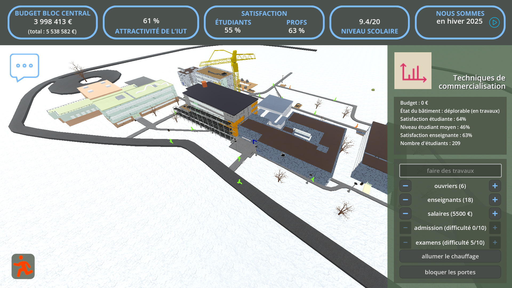
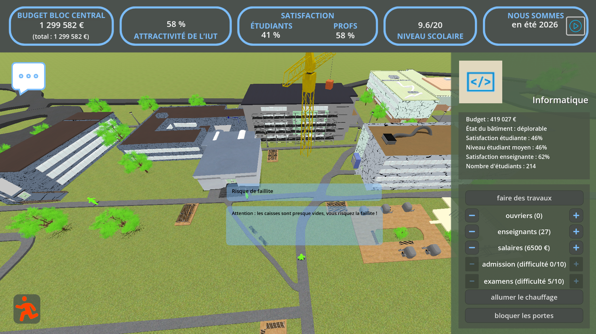
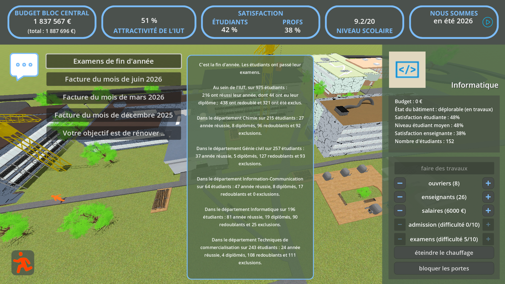

# T3 - RenovIUT

- Nom du groupe : Coruscant
- Membres du groupe : [Yasmine CHETTATI](https://git.unistra.fr/ychettati), [Elena FRISON](https://git.unistra.fr/e.frison), [Martin FRISON](https://git.unistra.fr/martin.frison).

	[Adrien AKGUL](https://git.unistra.fr/aakgul) a également contribué au projet à ses débuts.

## Présentation du projet

Vous incarnez le directeur de l'IUT Robert Schuman qui intervient sur le campus d'Illkirch pour assurer l'entretien et les rénovations des bâtiments et des infrastructures, tout en faisant face aux aléas du quotidien.

### Captures d'écran

Toutes les images utilisées sont libres de droits :
- [Banque de photos de l'IUT Robert Schuman](https://seafile.unistra.fr/d/03767a1835b7493b83a6/?p=%2FBelles%20photos%20(libre%20de%20droits&mode=list) ;
- Dessinées par nous-mêmes, à base d'images libres trouvées sur Internet.

<small>Fig.1. Début du jeu</small>

<small>Fig.2. Fenêtre principale : le campus au printemps</small>

<small>Fig.3. Vue de devant</small>

<small>Fig.4. Notification volante</small>

<small>Fig.5. L'historique</small>

### Installation et exécution

Pour lancer le jeu, il suffit de ... SECTION À REMPLIR

## Cahier des charges

### Objectifs pédagogiques généraux
En tant que [serious game](#jeux-sérieux), RenovIUT ne se limite pas à vous divertir, mais a également des objectifs pédagogiques, à savoir :

- *Comprendre* le rôle du directeur de l'IUT, établissement à une administration relativement autonome, dans l'entretien et la rénovation de ses locaux, en adéquation avec ses engagements sociaux ;
- *Découvrir* les bonnes pratiques de gestion du budget d'un IUT, alimenté de sources de financement certes multiples mais limitées, afin d'assurer les meilleurs conditions de travail possibles pour ses étudiants et son corps enseignant ;
- *Expérimenter* la prise de décision en situation d'urgence, nécessitant une remise en question des priorités de l'établissement.

### Objectifs pédagogiques avancés

Sur un mandat de 5 ans ou sur un temps illimité selon le scénario, vous devez rénover les bâtiments et les infrastructures, [en gérant votre budget partagé entre les dépenses d'énergie, les salaires et les rénovations](#missions) et [en répondant aux aléas qui se présentent]. Comme [le budget](#budget) n'est pas extensible à l'infini, que le temps passe vite et que les intérêts de tout le monde ne sont pas forcément conciliables, il va falloir faire des [choix](#actions-du-joueur) !

Votre objectif ultime est [soit](#scénarios) de gérer au mieux les ressources qui vous sont confiées, soit de vous faire réélire à la fin du mandat. Normalement, vous devrez maintenir de bonnes conditions de travail et veiller à la satisfaction des étudiants et des enseignants - sauf si vous trouvez une meilleure stratégie pour écraser les concurrents ! (En revanche, ce serait dommage si vous deviez faire sombrer l'établissement pour assouvir vos rêves de grandeur...)

La problématique du jeu se construit autour de 4 éléments :

1. *Les infrastructures existantes* qui doivent être entretenues voire, à moment donné, réparées.

	- Évaluer l'état actuel des bâtiments et des installations
	- Concevoir un plan de rénovation
	- Assurer la coordination des parties prenantes
	- Choisir les prestataires

2. *Le budget*, le pivot des activités, car aucune intervention sur le campus n'est possible sans financement.

	- Élaborer un bugdet réaliste
	- Rechercher des sources de financement multiples
	- Assurer le suivi financier des projets
	- Faire des choix quand les moyens sont réduits

3. *Les parties prenantes*, qui sont avant tout les étudiants, mais aussi les enseignants, les personnels, l'Eurométropole...

	- Assurer une communication transparente avec tous les acteurs et parties prenantes
	- Veiller à la satisfaction des étudiants et des enseignants
	- Mettre en place des mécanismes d'amélioration continue
	- Savoir trancher si les intérêts des uns et des autres sont en conflit
    - Améliorer le niveau scolaire des étudiants de l' IUT 
'. *L' attractivité*, 

	- Développer des initiatives pour renforcer l'image du campus
	- Promouvoir les réussites et les atouts de l'institution
	- Améliorer les services et les infrastructures pour attirer de nouveaux étudiants
	- Améliorer le niveau scolaire des étudiant.

####  Références
##### Rénovations réalisées dans différents IUT :

- https://savoirs.unistra.fr/campus/les-locaux-du-departement-genie-civil-construction-durable-de-liut-robert-schuman-inaugures
- https://iutrs.unistra.fr/iut/historique
- https://www.univ-tln.fr/Projet-IUT-RENOV-premiere-etape-dans-la-renovation-du-campus.html
- https://iut-nancy-brabois.univ-lorraine.fr/renovation-energetique/
- https://fr.wikipedia.org/wiki/R%C3%A9novation_%C3%A9nerg%C3%A9tique

##### Jeux sérieux :

- https://larevuedesmedias.ina.fr/les-serious-games-un-objet-en-construction
- https://fr.wikipedia.org/wiki/Jeu_s%C3%A9rieux
- http://serious.gameclassification.com/FR/index.html

### Description des fonctionnalités

#### Simulation

*Le pas de la simulation est d'un trimestre.*

- Le déroulement de la simulation est structuré par trimestres, permettant au joueur d'interagir régulièrement avec les événements et les problématiques qui surviennent. Chaque trimestre, le directeur de l'IUT incarné par le joueur doit réagir rapidement aux différentes sollicitations, qu'il s'agisse de la gestion des infrastructures, du suivi budgétaire ou des relations avec les parties prenantes.
- Pour rappeler que la gestion d'un établissement éducatif se fait souvent dans l'urgence, le gameplay est extrêmement rapide : en une minute, le directeur de l'IUT incarné par le joueur est censé réagir à toutes les sollicitations d'une année.
- Comme dans la vraie vie, il n'arrivera sans doute pas à répondre à toutes, les problèmes non résolus aggravant la situation.
- Également comme dans la vraie vie, on est bien obligé de choisir entre le mal et le pire, dans certaines situations.
- Mais pour refléter la réalité de la gestion d'un établissement éducatif, certains paramètres majeurs ne sont mis à jour qu'à la fin de l'année :
    L'attractivité : Elle est recalculée en fonction des actions menées tout au long des quatre trimestres, comme la gestion des infrastructures, et le niveau de satisfaction des étudiants et des enseignants.
    Le taux de réussite : Il est déterminé en fin d'année sur la base des efforts réalisés pour améliorer le niveau des étudiants, leur satisfaction, et une part d'aléatoire pour refléter les imprévus de la vie.

*À la fin de chaque trimestre, le nombre d'enseignants est susceptible de changer.*
- *Le nombre d'enseignants :*.Il est susceptible de changer à la fin de chaque trimestre en fonction des effectifs étudiants. Une baisse importante du nombre d'étudiants peut contraindre à réduire le nombre d'enseignants, tandis qu'une surpopulation étudiante exige le recrutement de nouveaux enseignants. Cependant, le nombre d'enseignants ne varie pas de manière continue mais par paliers, selon des valeurs seuils spécifiques.
- *Le nombre d'administratifs*. Contrairement aux enseignants, le joueur peut décider d'embaucher un nombre illimité d'administratifs pour renforcer la gestion des tâches administratives. Cependant, cela a un coût direct sur le budget et peut influencer indirectement la satisfaction des parties prenantes, en optimisant ou alourdissant les processus internes. Le joueur doit trouver un équilibre entre les besoins de gestion et les contraintes financières.
- *L'état des bâtiments*. Il dépend de leur âge, de leur état initial au début de l'année, et des éventuelles réparations réalisées au cours des trimestres. Ces réparations sont directement liées au budget alloué.
- *Le budget octroyé*.Il est mis à jour à la fin de chaque trimestre en fonction des dépenses réalisées, des financements obtenus (subventions, partenariats, autres sources). Le joueur peut choisir d’ajuster ses priorités budgétaires en fonction des besoins.
- *La satisfaction*.Calculé séparément pour les étudiants et les enseignants, il reflète leur perception de la qualité des services, des infrastructures et de la gestion globale. Pour les étudiants, cette satisfaction est également visualisée directement dans le jeu : les étudiants qui se déplacent autour du campus changent de couleur en fonction de leur niveau de satisfaction.

*À la fin de chaque année, différents calculs sont réalisés.*

Plusieurs paramètres décrivant le campus changent d'une année à l'autre :

- *Le taux de réussite*. Ne concerne que les étudiants et dépend de la satisfaction de ces derniers, mais aussi de leur niveau (partie déterministe) et de la chance qu'ils auront eu, à l'Institut ou en dehors (partie aléatoire).
- *L'attractivité*. Elle évolue en fonction des efforts fournis au cours de l'année pour promouvoir l'image de l'institution, de la satisfaction des parties prenantes surtout le niveau scolaire des étudiants, ainsi que de la qualité des services et infrastructures disponibles. Une attractivité accrue peut avoir un impact positif sur le budget de l'année suivante grâce à un meilleur financement et un recrutement d'étudiants en hausse.
- *Le nombre d'étudiants*. Il varie en fonction de l'attractivité de l'institution. Une attractivité élevée attire davantage de nouveaux étudiants et réduit les départs en cours d'année, tandis qu'une attractivité faible peut entraîner une baisse du recrutement et une augmentation des abandons.

##### Tutoriel
Dès le début du jeu, un mode tutoriel en 2D est proposé pour guider les nouveaux joueurs dans la prise en main des mécanismes principaux. Ce tutoriel interactif présente l’interface, explique les différentes statistiques du jeu (budget, attractivité, satisfaction, etc.), et décrit les premières actions à effectuer pour progresser dans la gestion de l’IUT. Une fois le tutoriel terminé, le joueur accède au jeu principal et faire ses missions selon le scénario choisi. 

#### Interface

Au début, le menu pour choisir le scénario et activer le mode tutoriel est en 2D . Ensuite, l'interface de jeu passe en 3D mais intègre des éléments 2D tels que les panneaux et les boutons. 

- Plan du campus d'Illkirch, vue du dessus
- Représentation visuelle de la satisfaction des étudiants dans le jeu : 
     des personnages en 3D se déplacent sur le campus, leur couleur variant en fonction de leur niveau de satisfaction.

- Affichage des informations complètes sur un bâtiment sélectionné avec un clic :
	- nom du département qui l'occupe ;
	- son âge
	- sa superficie
	- effectifs du corps enseignant et des étudiants ;
	- le niveau de satisfaction des uns et des autres ;
	- état des infrastructures :
		- chauffage
		- nombre d'agents d'entretien qui y interviennent

- Affichage du budget, simple montant (par bâtiment), montant du bloc cental ,ou composition détaillée (total du campus)
- Affichage de l'attractivité de l' IUT
- Affichage de la satisfaction des enseignants et des étudiants

- Notifications :
	- missions courantes
	- aléas auquels le joueur doit faire face :
		- soit en prenant une décision via une fenêtre pop-up (choix multiple)
		- soit en en assumant la conséquence inévitable

- Affichage du bilan de chaque trimestre et de l'année pour l'ensemble de l'IUT :
	- satisfaction étudiante et professorale ;
	- évolution du nombre d'étudiants et d'enseignants ;
	- financements prévus pour l'année prochaine ;
	- liste des rénovations planifiées accompagnées de leur coût

- Bouton pour passer à l'année suivante

- Timeline pour désigner la progression dans le temps

- Écran de fin de jeu affichant le score et une explication de la fin suivant le scénario choisi :
	- Quel(s) problème(s) a-t-on réussi à régler ? Le(s)quel(s) rest(ent) à résoudre ?
	- Quel est l'impact des interventions sur le bien-être des étudiants et des enseignants ? Comment se porte l'IUT, de manière générale ?
	- A-t-on été réélu (et à quel prix) ?

#### Actions du joueur

Le jeu consiste à répondre aux défis qui surgissent, attendus ou imprévus, en faisant des choix avisés quand on peut (il est à noter que dans certains cas, aucune action n'est possible).

Pour ce faire, le directeur aka joueur peut, concrètement :

- Valider toutes des rénovations planifiées ou seulement quelques-unes ;
- Redistribuer les allocations du budget ;
- Ajuster le calendrier de chauffage ;
- Licencier ou recruter des enseignants ou des administratifs pour réduire les dépenses, en tenant compte des impacts sur la satisfaction et la qualité pédagogique.
- Recruter ou licencier des administratifs pour répondre aux besoins de rénovation et réduire la durée des travaux .

#### Scénarios

Deux facteurs déterminent les choix d'un directeur :

- la situation de départ à laquelle il est confronté et
- l'objectif qu'il poursuit.

Nous proposons trois scénarios qui varient ses deux données.

##### Scénario 1 : Rénover l'IUT

votre objectif est de moderniser et d'améliorer les infrastructures de l'IUT afin d'offrir un environnement d'apprentissage optimal. Au départ, tous les paramètres sont situés entre des niveaux moyens et bas, et en tant que directeur, vous devez redresser la situation générale tout en préservant la qualité de l'enseignement. Ce scénario se concentre principalement sur la rénovation des bâtiments existants, tels que les salles de classe, les laboratoires et les bibliothèques, ainsi que sur la construction de nouvelles installations. L'amélioration des infrastructures vise à augmenter la satisfaction des étudiants et du personnel, mais nécessite une gestion budgétaire rigoureuse en raison des investissements financiers conséquents. Vous devrez également relever des défis tels que la gestion des délais et des retards pour éviter les dépassements de coûts, ainsi que le maintien d'un équilibre financier entre les dépenses de rénovation et les revenus de l'institut.  

La partie a une durée illimitée, vous permettant de sortir à tout moment, avec les résultats calculés en fonction de vos acquis actuels. 
- Vous gagnez si vous parvenez à atteindre au moins 51 % pour tous les paramètres, avec des bonus supplémentaires si certaines statistiques dépassent 65 % voire 80 %. 
- En revanche, vous perdez si même un seul paramètre tombe en dessous du seuil requis, compromettant ainsi le succès global de votre. 

##### Scénario 2 :Me faire réelir

Votre objectif est de gagner la confiance des membres du Conseil d'administration de l'IUT, composé des enseignants et des étudiants, afin d’être réélu en tant que directeur. Pour cela, vous devez améliorer les performances globales de l’IUT tout en maintenant un équilibre entre la satisfaction des parties prenantes, la gestion des budgets, et l’attractivité de l’établissement.

Au départ, tous les paramètres sont à une valeur moyenne, indiquant que l'IUT fonctionne correctement sans exceller dans aucun domaine. La partie dure 5 ans, et votre réélection dépendra des votes calculés par bâtiment, sans possibilité de second tour.
- Vous gagnez si vous être réélu, avec un score qui correspond au nombre de voix portées pour ;
- Vous perdez si vous devez quitter votre poste de directeur. Mais ne désespérez pas, vous avez probablement tout fait pour le bien de l'établissement !

##### Scénario 3 : Viser l'excellence

Votre objectif est de transformer l'IUT en une référence nationale et internationale en matière d'éducation, de recherche et de gestion. Pour ce faire, vous devez exceller dans plusieurs domaines stratégiques, tels que la satisfaction des parties prenantes, l’état des infrastructures, la qualité de l’enseignement et l’attractivité de l’établissement.

La partie dure 5 ans

- Vous gagnez si vous atteignez un bon niveau global des élèves (moyenne de 16/20) et des diplômés qui intègrent des écoles prestigieuses ou obtiennent une insertion professionnelle de qualité.
- Vous perdez si vous échouez à atteindre ces deux objectifs dans le délai imparti. Mais votre gestion aura sans doute permis à l’IUT de progresser pour de futures tentatives.

####  Musique et sons: 
Dans Renov IUT, la musique et les effets sonores jouent un rôle essentiel pour créer une atmosphère immersive et renforcer l'expérience de jeu. Une conception audio bien pensée contribue non seulement à l'immersion du joueur mais aussi à la compréhension des événements et des actions au sein de l'institut. Voici une description détaillée des éléments audio intégrés dans le jeu. 

    Clics et Sélections : Sons subtils pour les interactions avec les menus et les boutons, améliorant la réactivité de l'interface. 

    Notifications : Sons distinctifs pour les alertes importantes, telles que les mises à jour budgétaires ou les événements critiques. 

    Bruit de Fond : Sons ambiants typiques d'un campus universitaire, tels que les discussions d'étudiants, les bruits de pas, et les activités quotidiennes, pour renforcer l'immersion. 

### Contraintes de développement

Ce jeu a été développé avec le moteur [Godot Engine 4](https://godotengine.org/).

Le code est modularisé suivant le patron de conception [MVC](https://www.geeksforgeeks.org/mvc-design-pattern/), tout en respectant l'organisation d'un projet Godot :

- Les vues, les contrôleurs et les modèles se trouvent dans les répertoires dédiés views/, controllers/ et models/, respectivement.
- Les *vues* sont scindées en scenes/ et nodes/.
- Les *contrôleurs* assurent le traitement des données et le déroulement du jeu.
- Les *modèles* sont indépendants et ne sont que consultés par les vues (i.e. l'interface utilisateur) et modifiés par les contrôleurs (i.e. la logique du jeu).
- Les *données* sont stockées dans des tables SQL (TeacherSQLTable, StudentSQLTable, FundSQLTable et NotificationSQLTable).

### Amélioraton possibles 

Fonctionnalités à implémenter :
- Différentes sources de financement : Ajouter des options variées de ressources financières, comme des subventions de l'État, des partenariats avec des entreprises, des campagnes de financement participatif, ou des revenus générés par des événements organisés par l'IUT. Chaque source pourrait avoir ses propres avantages et contraintes.

- Choix des entreprises pour les rénovations : Permettre au joueur de sélectionner parmi plusieurs entreprises de rénovation, chacune ayant des caractéristiques différentes (coût, rapidité, qualité des travaux). Les choix influenceraient directement l'état des bâtiments et le budget disponible.

- Choix du niveau de difficulté au début du jeu : Ajouter différents niveaux de difficulté pour personnaliser l’expérience de jeu :

    Facile : Ressources abondantes, tolérance élevée aux erreurs.
    Intermédiaire : Budget limité, attentes des parties prenantes plus strictes.
    Difficile : Ressources rares, crises fréquentes, exigences élevées.

- Gestion des crises aléatoires : Implémenter des événements imprévus tels qu’une grève du personnel, des dégradations majeures dans un bâtiment, ou une baisse soudaine des financements. Le joueur devra adapter sa stratégie pour faire face à ces situations.
- Entretien régulier du campus : En plus des rénovations majeures, proposer des tâches d’entretien récurrent (nettoyage, petits travaux de réparation, maintenance technique).